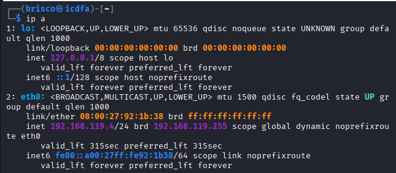
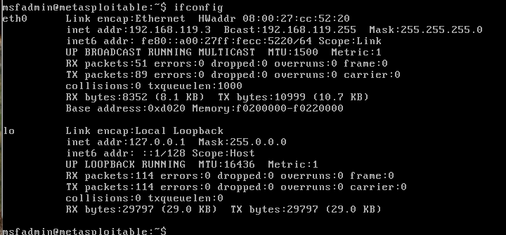
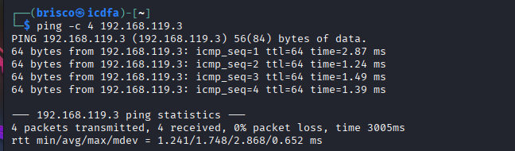

# Part 1: Prepare the Lab

## Step 1: Find Kali IP

I ran the following command on my Kali machine:

```
ip addr
```



I ignored the lo interface since that is always 127.0.0.1 and only concerns the machine itself. On the eth0 interface I found my working address: 192.168.119.4/24, with the MAC address 08:00:27:92:1b:38. This is the address I used as my source for every scan in this lab.

## Step 2: Find Metasploitable 2 IP

I ran the following command directly inside the Metasploitable 2 console:

```
ifconfig
```



Metasploitable 2 uses the older ifconfig command instead of ip addr, which already tells me this is an old system. On eth0 I found the address 192.168.119.3, with the MAC address 08:00:27:cc:52:20. This confirmed my target is on the same subnet as my Kali machine (192.168.119.0/24), so the two machines can talk to each other directly.

## Step 3: Confirm connectivity

I tested the connection between the two machines with:

```
ping -c 4 192.168.119.3
```



I sent 4 ICMP packets and got 4 replies back, with 0% packet loss. The response times were between 1.24 ms and 2.87 ms, which is normal for two virtual machines running on the same host. This confirmed that my Kali machine can reach Metasploitable 2 before I started scanning it.
