# Part 3: Core Nmap Scans

## Step 4: Host discovery

```
nmap -sn 192.168.119.0/24
```

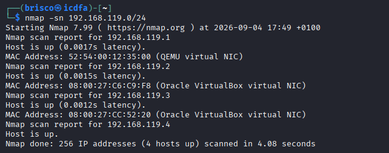

This scan does not check any ports, it only tells me which hosts on my subnet are alive. I found 4 hosts up out of the 256 addresses in the range, scanned in 4.08 seconds. The address 192.168.119.1 is the gateway (a QEMU virtual NIC), 192.168.119.2 is another VirtualBox machine present on the same network but not my target, 192.168.119.3 is my Metasploitable 2 target (its MAC address matches what I already recorded in Step 2), and 192.168.119.4 is my own Kali machine. This confirmed which address I needed to scan next.

## Step 5: Default TCP scan

```
nmap 192.168.119.3
```

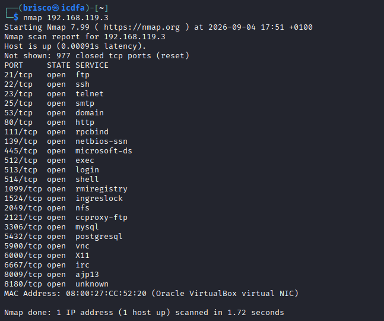

With no options, Nmap scanned its default set of common ports and found 23 open ports on Metasploitable 2, with 977 closed. The open ports were 21, 22, 23, 25, 53, 80, 111, 139, 445, 512, 513, 514, 1099, 1524, 2049, 2121, 3306, 5432, 5900, 6000, 6667, 8009 and 8180. This is already a large number of open services for one single machine, which tells me this box was deliberately set up with many old and insecure services running at the same time.

## Step 6: Service and version detection

```
nmap -sV 192.168.119.3
```

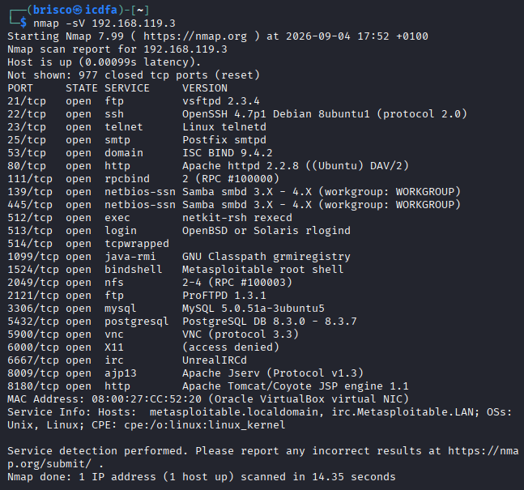

Adding -sV let Nmap actually connect to each open port and read what software answered. This is where I got real version numbers instead of just guesses: vsftpd 2.3.4 on port 21, OpenSSH 4.7p1 Debian 8ubuntu1 on port 22, Linux telnetd on port 23, Postfix smtpd on port 25, ISC BIND 9.4.2 on port 53, Apache httpd 2.2.8 (Ubuntu) DAV/2 on port 80, Samba smbd 3.X to 4.X on ports 139 and 445, a bindshell described directly as "Metasploitable root shell" on port 1524, ProFTPD 1.3.1 on port 2121, MySQL 5.0.51a on port 3306, PostgreSQL 8.3 on port 5432, UnrealIRCd on port 6667, and Apache Tomcat on port 8180. Seeing a port literally labelled "root shell" told me straight away that this machine is intentionally full of serious vulnerabilities. The scan took 14.35 seconds.

## Step 7: Maximum version intensity

```
nmap -sV --version-intensity 9 192.168.119.3
```

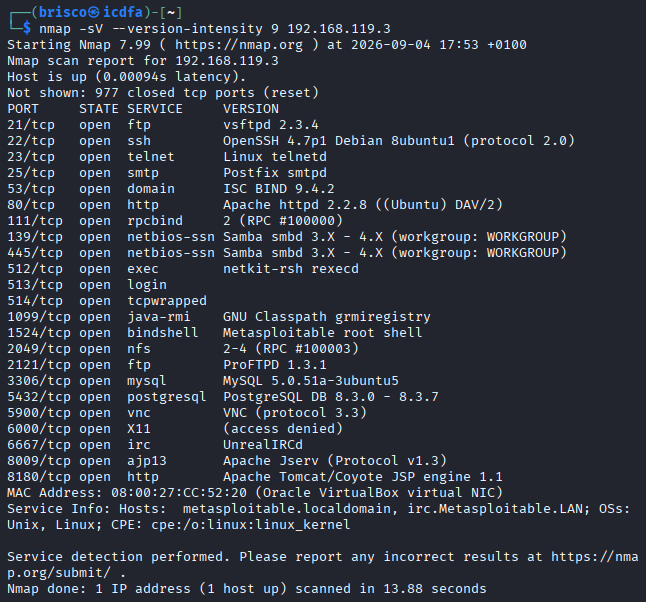

I pushed the version detection to its maximum intensity to see if I could get more detail than Step 6. The result was exactly the same list of ports and versions, just scanned slightly faster at 13.88 seconds instead of 14.35. This told me that on a simple, well known target like this one, the default intensity was already enough to identify everything correctly, so going to intensity 9 did not add any new information in my case.

## Step 8: OS detection

```
sudo nmap -O 192.168.119.3
```

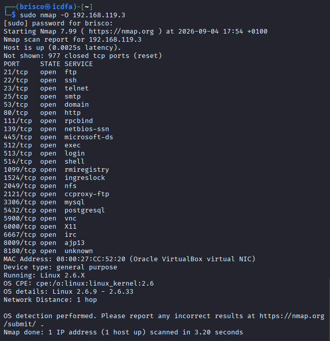

This command needed my sudo password because guessing the operating system requires sending raw packets. Nmap reported the device as a general purpose machine running Linux 2.6.X, more precisely somewhere between kernel 2.6.9 and 2.6.33, with a network distance of 1 hop, meaning Metasploitable 2 is directly on my local network with nothing in between. The scan finished in 3.20 seconds.

## Step 9: Aggressive scan

```
sudo nmap -A 192.168.119.3
```

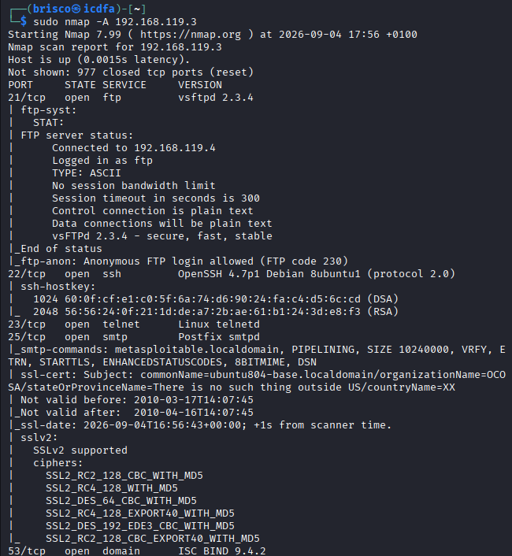

This single command combined OS detection, version detection and the default scripts. The extra detail I got compared to Step 5 was significant. On port 21, the ftp-anon script showed that anonymous FTP login is allowed, and Nmap even logged in as the ftp user to confirm it, receiving FTP code 230. On port 22, I got the exact SSH host keys, a 1024 bit DSA key and a 2048 bit RSA key with their fingerprints. On port 25, I saw the SMTP server's SSL certificate details, and this certificate looked clearly fake and outdated, valid only from March to April 2010, with an organization name reading "There is no such thing outside US" and country code XX, plus a list of very old and weak SSLv2 ciphers being accepted. These three findings alone (anonymous FTP, exposed SSH keys, and a broken expired certificate with weak ciphers) are three clear extra pieces of information I did not have from the plain scan in Step 5.

## Step 10: Full TCP port scan

```
sudo nmap -p- 192.168.119.3
```

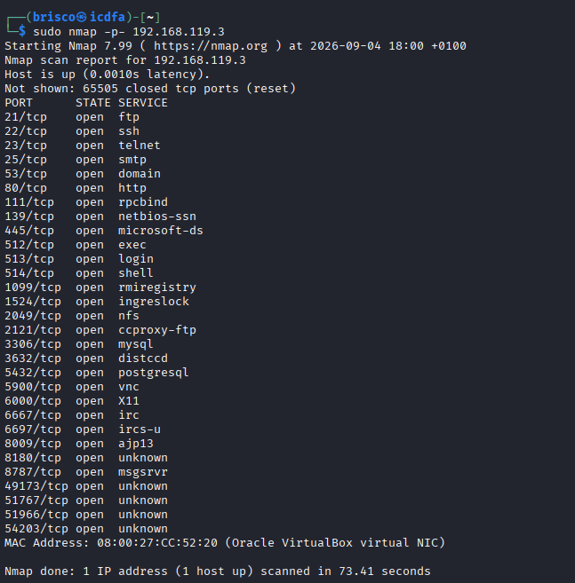

Checking every one of the 65535 TCP ports instead of just the default set found me 30 open ports instead of the 23 from Step 5, with 65505 closed. The 7 additional ports were 3632 (distccd), 6697 (ircs-u), 8787 (msgsrvr), and four unnamed high ports: 49173, 51767, 51966 and 54203. None of these would have appeared if I had only run the default scan, which shows why checking every port matters on a machine like this one. The scan took 73.41 seconds.

## Step 11: Full TCP scan with versions

```
sudo nmap -p- -sV 192.168.119.3
```

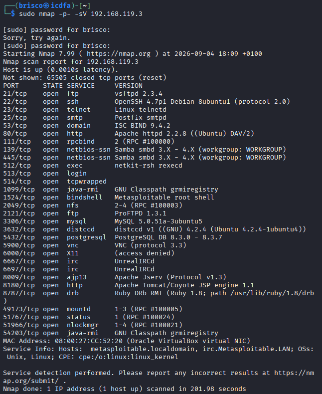

I mistyped my sudo password once here before getting it right. This scan gave me the most complete picture of the whole lab: all 30 open ports with their exact versions. The new services I could now name properly were distccd v1 (GNU 4.2.4) on port 3632, a second UnrealIRCd instance on port 6697, a Ruby DRb service on port 8787 that even revealed a real file path on the system (/usr/lib/ruby/1.8/drb), and three RPC related services on the high ports: mountd on 49173, status on 51767 and nlockmgr on 51966, plus another java-rmi service on 54203. This scan took 201.98 seconds, much longer than Step 10, because checking the version of 30 services takes far more time than just confirming they are open. I used this scan as the source for my final service inventory in Part 7.

## Step 12: Timing template

```
sudo nmap -p- -T4 192.168.119.3
```

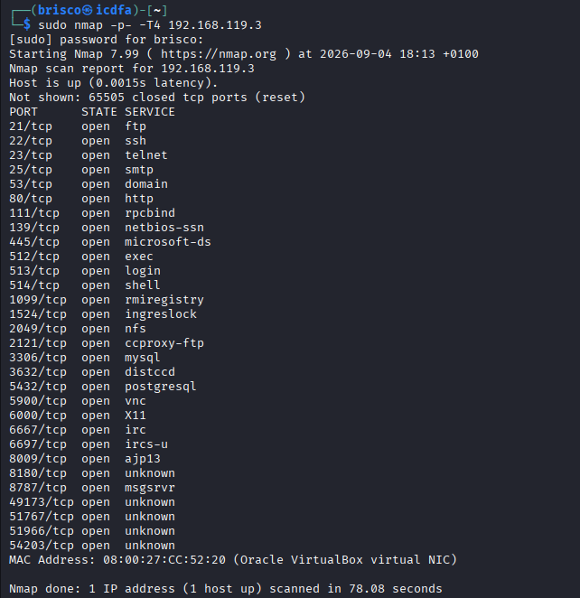

I expected the faster T4 timing template to speed things up compared to Step 10. The same 30 ports were found, but the scan actually took 78.08 seconds, a little longer than Step 10's 73.41 seconds. On this small isolated lab network, the connection was already fast enough that the default timing was not really a bottleneck, so T4 did not make a real difference here. This was not what I expected in theory, but it is what I actually observed.

## Step 13: Selected ports

```
nmap -p 21,22,23,25,80,139,445 192.168.119.3
```

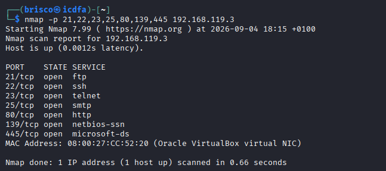

Limiting the scan to only 7 specific ports I already knew about finished in 0.66 seconds, all 7 came back open. This kind of focused scan is useful when I already know which services I care about and just want to check them again quickly, for example to confirm a service is still running, without waiting for a full scan.

## Step 14: Port range

```
sudo nmap -p 1-1024 192.168.119.3
```

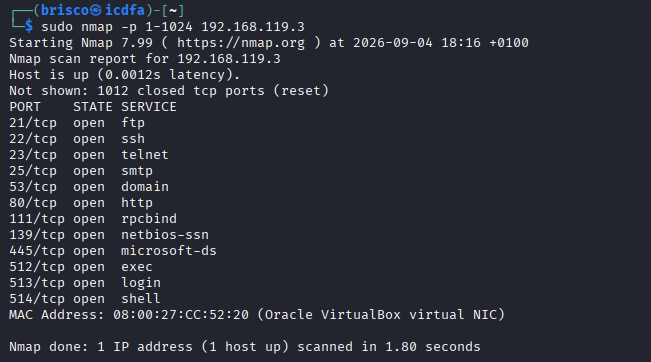

Scanning the whole 1 to 1024 range found 12 open ports in 1.80 seconds: the 7 ports from Step 13 plus 53, 111, 512, 513 and 514. This confirmed that Step 13's ports are simply a subset of what this wider range contains.

## Step 15: UDP scan

```
sudo nmap -sU 192.168.119.3
```

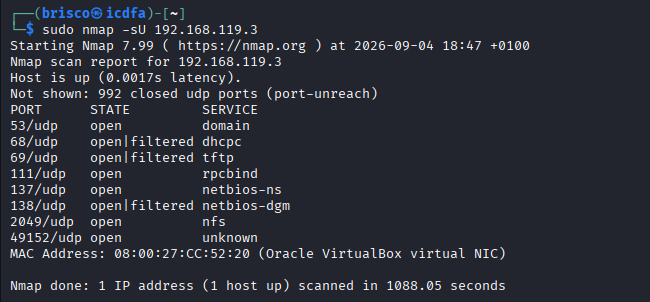

This scan checked all UDP ports and took 1088.05 seconds, just over 18 minutes, which is dramatically longer than any of my TCP scans. I found 8 relevant results: port 53 (domain) came back clearly open, ports 68 (dhcpc), 69 (tftp) and 138 (netbios-dgm) came back as open|filtered, port 111 (rpcbind), 137 (netbios-ns) and 2049 (nfs) came back open, and port 49152 came back open as well. 992 ports were reported closed. This scan is where I really felt the difference in speed between TCP and UDP scanning.

## Step 16: Top UDP ports with versions

```
sudo nmap -sU --top-ports 20 -sV 192.168.119.3
```

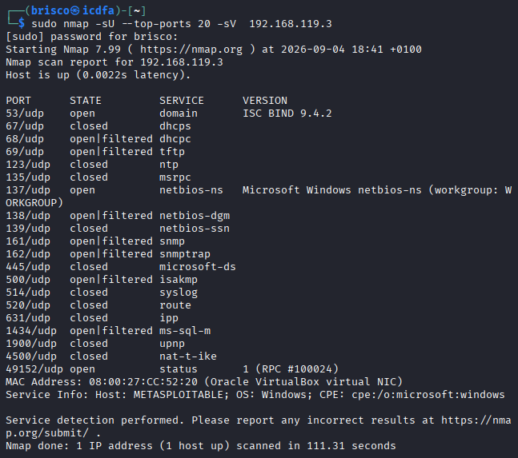

Limiting the UDP scan to only the top 20 most common ports brought the time down to 111.31 seconds, far more manageable than the full scan in Step 15. I got version information this time: port 53 confirmed ISC BIND 9.4.2 again, and port 137 identified itself as Microsoft Windows netbios-ns with workgroup WORKGROUP. What struck me here is that at the bottom of the result, Nmap's own service info line guessed the operating system as Windows, purely because of that NetBIOS response, even though I already know from Steps 8 and 9 that this machine is actually Linux. This showed me that a single UDP service can sometimes mislead automatic OS guessing if I only look at that one clue.
