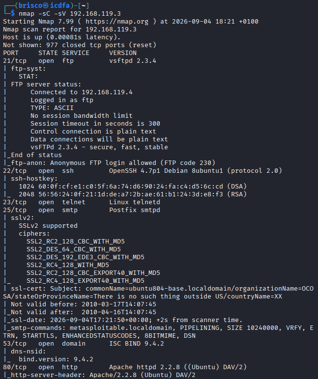
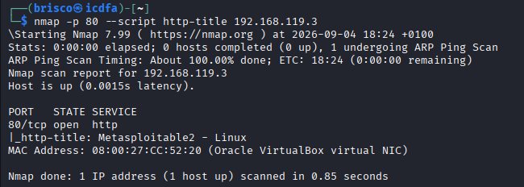
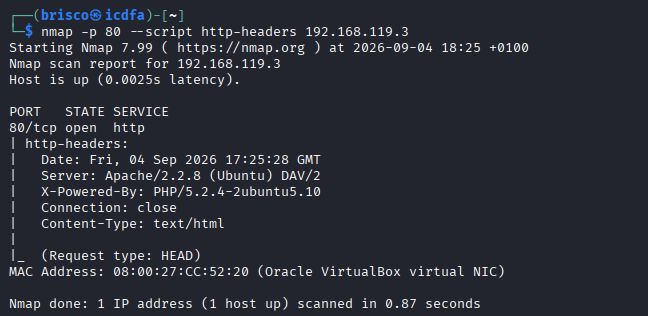
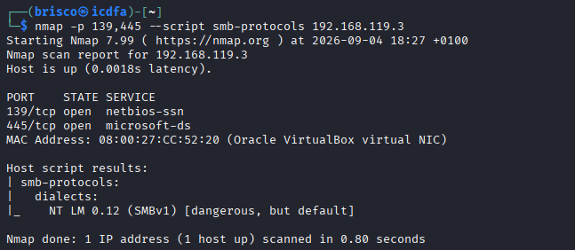
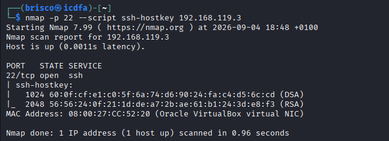
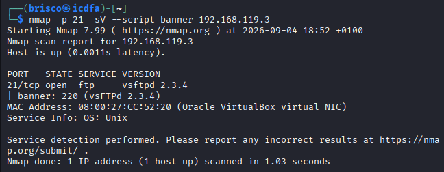

# Part 4: Safe Nmap NSE Enumeration

## Step 17: Default scripts

```
nmap -sC -sV 192.168.119.3
```



Running the default script set together with version detection gave me the same kind of detail I already saw in Step 9, plus a bit more. I confirmed again that anonymous FTP login is allowed on port 21, and I got the same SSH host keys on port 22 (1024 bit DSA and 2048 bit RSA). I also saw the same expired and suspicious SSL certificate on port 25, and this time the output also showed me the DNS server version directly through the dns-nsid script (bind version 9.4.2) and the exact Apache header on port 80 (Apache/2.2.8 (Ubuntu) DAV/2). The two findings I consider the most useful from this step are the anonymous FTP access and the SSH host key fingerprints, since both give me concrete facts I can act on rather than just a version number.

## Step 18: HTTP title

```
nmap -p 80 --script http-title 192.168.119.3
```



This one is simple and direct. The title of the web page on port 80 is "Metasploitable2 - Linux". This alone already tells me exactly what machine I am looking at without even opening a browser.

## Step 19: HTTP headers

```
nmap -p 80 --script http-headers 192.168.119.3
```



The headers gave me more detail than the title alone. I got the date and time of the response, the Server header confirming Apache/2.2.8 (Ubuntu) DAV/2, an X-Powered-By header revealing PHP/5.2.4-2ubuntu5.10, a Connection: close header, and the Content-Type as text/html. The PHP version here is new information I did not have from the plain Nmap version scan in Step 6, since that scan only identifies the web server itself, not the scripting language running behind it.

## Step 20: SMB protocols

```
nmap -p 139,445 --script smb-protocols 192.168.119.3
```



This script checked which SMB dialect versions the Samba service supports. The result showed only one dialect, NT LM 0.12, which is SMBv1, and Nmap itself labelled it directly as "dangerous, but default" in the output. This is a strong, clear signal that this service is running a very outdated and insecure configuration.

## Step 21: SSH host keys

```
nmap -p 22 --script ssh-hostkey 192.168.119.3
```



This confirmed the same two SSH keys I already saw in Steps 9 and 17: a 1024 bit DSA key and a 2048 bit RSA key, each with its own fingerprint. Getting the exact same result three separate times across different scans gave me confidence that this information is accurate.

## Step 22: FTP banner

```
nmap -p 21 -sV --script banner 192.168.119.3
```



The banner script simply read the greeting text sent by the FTP service, which was "220 (vsFTPd 2.3.4)". This matches exactly what the -sV scan in Step 6 already told me (vsftpd 2.3.4). Getting the same version from two completely different methods, one reading the banner directly and one using Nmap's signature matching, gave me a second confirmation of the same fact rather than new information, but that confirmation itself is valuable.
