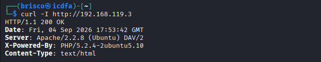

# Part 5: Manual HTTP Confirmation

## Step 23: Request headers with curl

```
curl -I http://192.168.119.3
```



I wanted to check the web server manually, without relying only on Nmap. The result was HTTP/1.1 200 OK, with the same Server header (Apache/2.2.8 (Ubuntu) DAV/2) and the same X-Powered-By header (PHP/5.2.4-2ubuntu5.10) that Nmap's http-headers script already gave me in Step 19. Getting an identical result from a completely different, much simpler tool confirmed that my earlier findings were correct and not a fluke of the scanning script.
