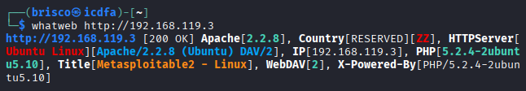
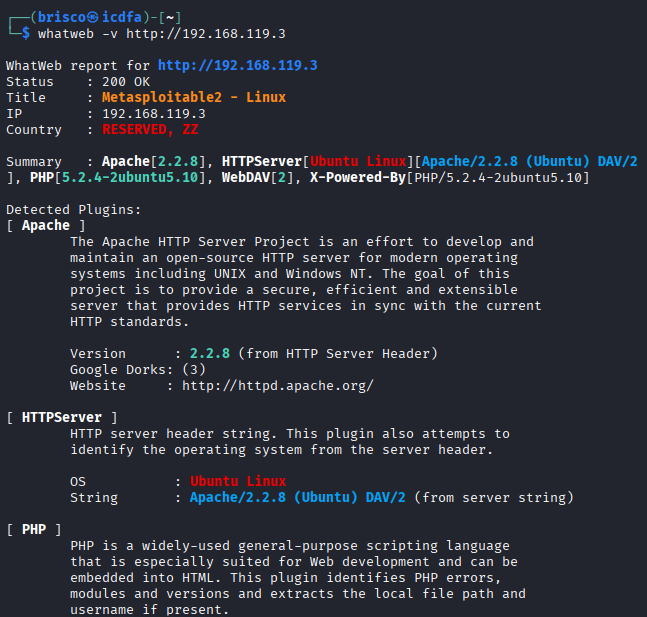
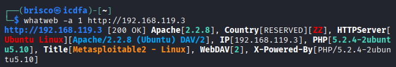
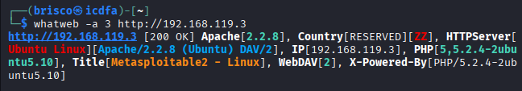
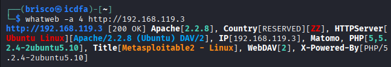
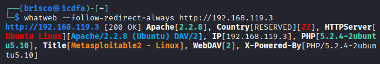
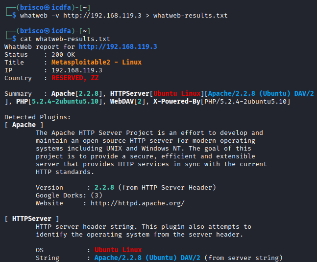

# Part 6: WhatWeb Fingerprinting

## Step 24: Basic fingerprint

```
whatweb http://192.168.119.3
```



The basic scan gave me a single dense line summarizing everything: Apache 2.2.8, HTTPServer identified as Ubuntu Linux with the full Apache/2.2.8 (Ubuntu) DAV/2 string, the IP address, PHP 5.2.4-2ubuntu5.10, the page title Metasploitable2 - Linux, a WebDAV flag, and the same PHP version again under X-Powered-By. This matched everything I had already found with Nmap and curl, which was reassuring.

## Step 25: Verbose output

```
whatweb -v http://192.168.119.3
```



The verbose mode took the exact same information and spread it out into a full report. Instead of just a summary line, I got a separate section for each detected plugin (Apache, HTTPServer, PHP), each with an explanation of what the plugin does, where the version came from, and even a link to the Apache project website and a count of related Google dorks. This did not add new technical facts compared to Step 24, but it explained clearly why WhatWeb believes what it believes.

## Step 26: Aggression level 1

```
whatweb -a 1 http://192.168.119.3
```



Level 1 gave me exactly the same result as the default scan in Step 24. This told me that the default aggression level is already equal to level 1, the lightest setting.

## Step 27: Aggression level 3

```
whatweb -a 3 http://192.168.119.3
```



At level 3 I noticed one small difference: the PHP field now showed "PHP[5, 5.2.4-2ubuntu5.10]" instead of just the full version number, meaning WhatWeb also matched the major version 5 separately. It is a small addition, but it is a real difference compared to level 1.

## Step 28: Aggression level 4

```
whatweb -a 4 http://192.168.119.3
```



At the highest aggression level, a new plugin appeared in the summary: Matomo, which is a web analytics tool. This was not present at level 1 or level 3. I am not convinced this detection is actually correct, since Metasploitable 2 is an old machine and I have no other evidence anywhere in this lab that it runs Matomo. My interpretation is that the more aggressive mode matched something too loosely and produced a result I should not fully trust without checking it another way. This is still a useful lesson: a higher aggression level can find more, but not everything it finds is necessarily reliable.

## Step 29: Follow redirects

```
whatweb --follow-redirect=always http://192.168.119.3
```



The result here was identical to Step 24 and Step 26, which tells me no redirect happened on this page. The default Metasploitable 2 landing page simply answers directly with a 200 OK, so there was nothing further for WhatWeb to follow.

## Step 30: Save results

```
whatweb -v http://192.168.119.3 > whatweb-results.txt
cat whatweb-results.txt
```



I saved the verbose scan into a text file and then displayed it again with cat to confirm it saved correctly. The content of the file matched exactly what I had already seen in Step 25, which confirmed the file was written properly and can be kept as evidence.
